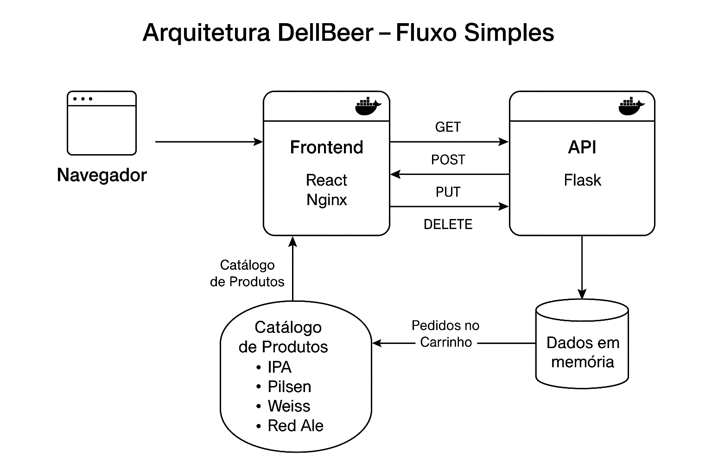

# 🍺 DellBeer – Loja Online de Bebidas

Projeto de uma loja online de cervejas artesanais, onde é possível visualizar produtos, realizar pedidos, gerenciá-los e finalizar compras. Desenvolvido como MVP com frontend em React e backend em Flask, ambos containerizados com Docker.

---

## 🚀 Tecnologias Utilizadas

- **Frontend**: React + HTML + CSS  
- **Backend**: Flask + Flask-CORS  
- **Containers**: Docker + Docker Compose  
- **Servidor Estático**: Nginx  
- **Comunicação**: API REST (GET, POST, PUT, DELETE)

---

## 📦 Funcionalidades

- Catálogo com 4 tipos de cerveja (IPA, Pilsen, Weiss, Red Ale)
- Adicionar produtos ao carrinho com quantidade
- Carrinho inteligente com contador de itens
- Finalização de compra com total calculado
- Cancelamento de pedidos individualmente
- Integração completa entre frontend e backend via API

---

## ⚙️ Como rodar o projeto

### 🔸 Pré-requisitos

- Docker instalado  
- Docker Compose instalado

---

### 🔹 Executando com Docker (recomendado)

1. Clone o repositório:
   ```bash
   git clone https://github.com/araujolsa/mvp-dellbeer
   cd mvp-dellbeer
   ```

2. Execute o projeto com:
   ```bash
   docker-compose up --build
   ```

3. Acesse no navegador:
   - Frontend: http://localhost:3000  
   - Backend/API: http://localhost:5000/orders

> O frontend já está configurado para se comunicar com a API Flask via `http://localhost:5000/orders`

---

### ✅ Dica

Caso a porta 5000 esteja ocupada, você pode trocar para outra no `docker-compose.yml`:
```yaml
  backend:
    ports:
      - "5001:5000"
```
E ajustar o endereço nas chamadas `fetch()` do frontend para `http://localhost:5001/orders`.

---

## 🔄 Rotas da API (Flask)

| Método | Rota              | Descrição                     |
|--------|-------------------|-------------------------------|
| GET    | `/orders`         | Lista todos os pedidos        |
| POST   | `/orders`         | Cria novo pedido              |
| PUT    | `/orders/<id>`    | Atualiza um pedido existente  |
| DELETE | `/orders/<id>`    | Remove um pedido              |

---

## 🧠 Estrutura do Projeto

```
mvp-dellbeer/
├── backend/              # API Flask
│   ├── app.py
│   ├── Dockerfile
│   └── requirements.txt
│
├── frontend/             # Interface React
│   ├── public/
│   ├── src/
│   │   ├── components/
│   │   ├── pages/
│   │   └── App.js
│   └── Dockerfile
│
├── docker-compose.yml    # Orquestração dos containers
└── README.md
```

## 📊 Arquitetura da Solução



Frontend React → API Flask (REST) → Banco de dados em memória (lista de pedidos)  
Comunicando via HTTP local: `localhost:3000` → `localhost:5000`


